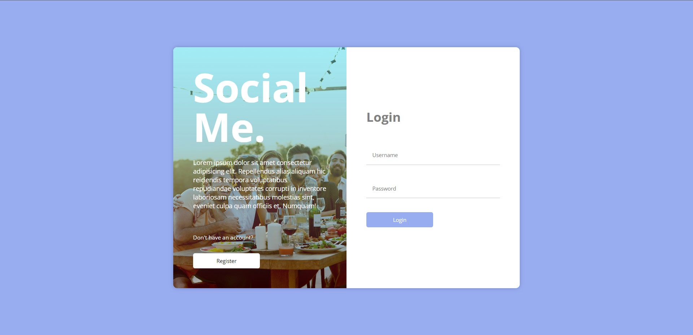
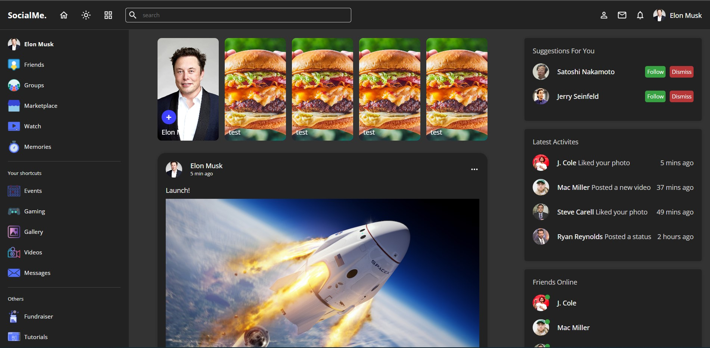
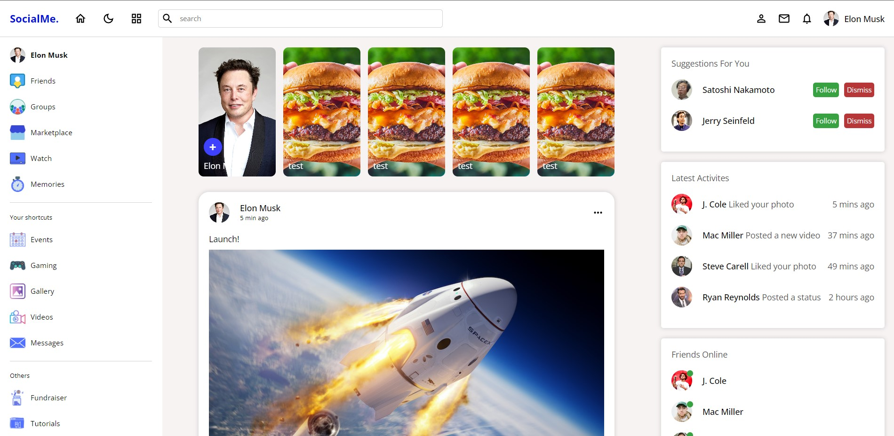
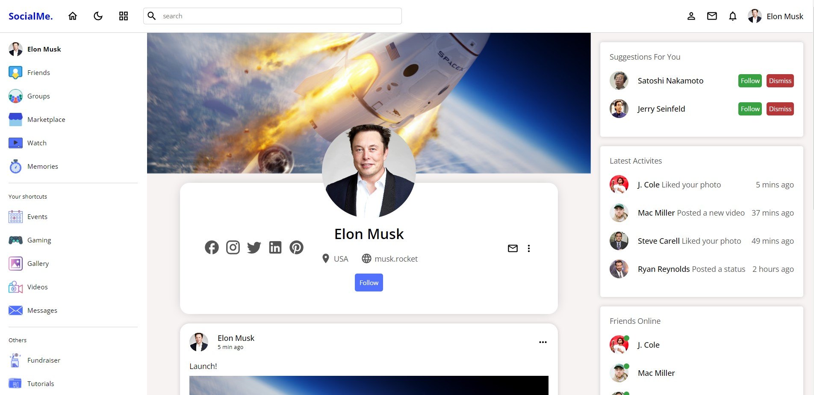

I created this modern social media web app to test my React frontend skills as well as adding a log in function to only show the pages if you are logged in. Currently this feautre is disbaled so that you can view the whole app easily.

This website is live here - https://social-app-bp.netlify.app

Log In

Home Page Dark

Home Page Light

Profile Page https://social-app-bp.netlify.app/profile/1

